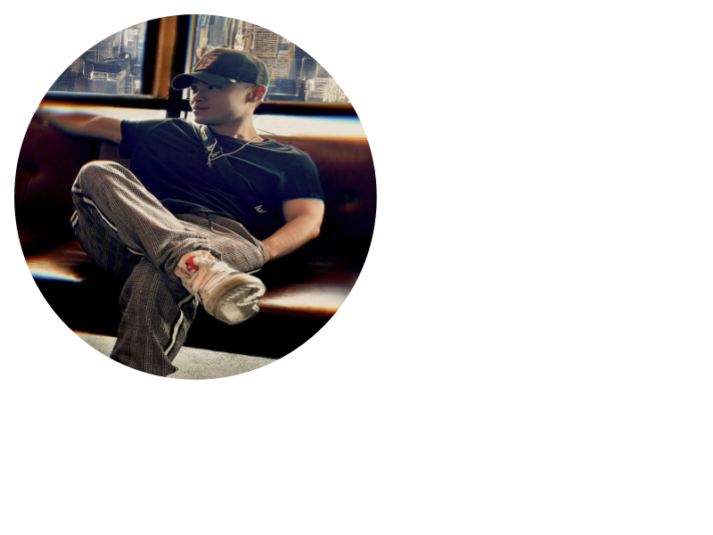
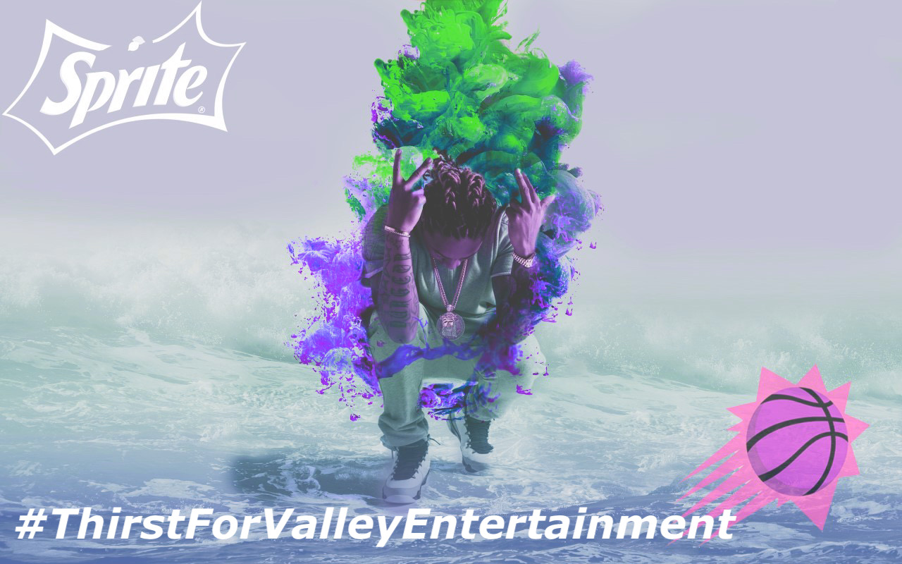

#### Im a driven and adaptable professional with a well-rounded background and a strong passion c=for content and marketing. My experience across various roles and industries has equipped me with creativity, strategic and communication a blend of different types of unique skills. I am highly coachable, collaborative and eager to grow. I thrive in dynamic environments and excited to bring value to a team where I can contribute to compelling content, impactful marketing campaigns and meaningful storytelling with the brand I am working for. I am currently seeking to get back into the content and marketing space where I can continue molding my skills.

# My Portfolio 

### Technical Skills: AWS, Hubspot, Google Workspace, Python, SquareSpace, Highlevel, Figma, Notion, Asana

## Education
- Bachelors of General Business Degree, Sports & Media | Arizona State University (_2019_) 
- Minor Computer Science | University of Maryland (_Present_)
- Associates of Arts Degree | Chandler Gilbert Community College (_2015_)

## Projects
### BG Sports
- An international sports branding agency focus on creativity and strategic to elevate athletes and sports organzizations from  professional athletes to sports franchises the agency committed to delivering innovative branding solutions that drive engagement and foster loyalty
- [BG Sports: Website](https://www.bgseinc.com)
- Link to my [Dropbox](https://www.dropbox.com/scl/fo/00rd5rmpf41rxwjgibaux/AJS9C5VICq_yFOPAgrYW46Y?rlkey=mcs2il5hg61ybh21awc6zf8k4&e=1&dl=0) are examples of instagram contents that I have created. Example: of highlight reels and images
  
### Phoenix Suns
- 1 month internship opportunity where I helped led creative concepts to include Sprite as a future partner and strategies revolving around the Fry’s and Coke Phoenix Suns Partnership activation

#### Commercial Art 

### Amazon
#### Intranet Network
- Designed and built an internal intranet network of web pages to centralize SOPs and Process Map documentations, significantly reducing grapevine communication and improving information accessibility across teams. Skilled in workflow analysis, cross-functional collaboration, and continuous improvement to enhance operational efficiency and clarity. 

#### Project Management Platform : Asana & Monday
- Spearheaded the implementation of Asana as a project management tool across multiple departments at Amazon, improving cross-functional communication and project visibility.
- Developed and customized Asana workflows Developed and customized Asana workflows to align with team objectives, resulting in increased task ownership, accountability, and on-time project delivery.
- Trained team members & department leads: Reduced project delays and communication gaps by centralizing task tracking, documentation, and updates within the Asana platform.

